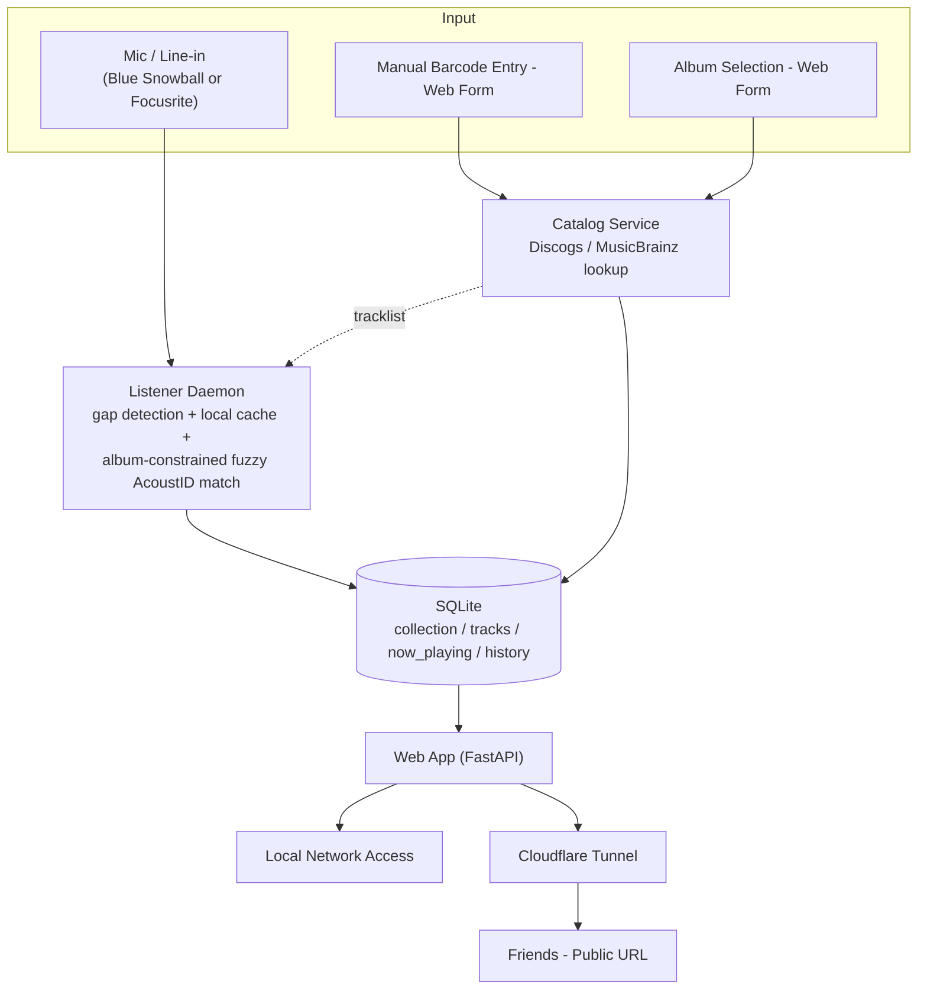

# Physical Media Tracker


A Raspberry Pi box that listens to your CD player, identifies what's playing via audio fingerprinting, and shows your collection — plus what's currently spinning — to friends on a live web page.

## How it works

- **Collection:** albums are cataloged by entering their barcode manually through a web form, which is looked up against the Discogs and MusicBrainz APIs for metadata, cover art, and tracklists.
- **Now playing:** you tell the app which album is about to play (`/listen`); a listener daemon then samples audio (mic or line-in), fingerprints it with Chromaprint (`fpcalc`), and identifies the track via the AcoustID API — constrained to that album's known tracklist, with a local fingerprint cache and silence-gap detection to keep it fast and responsive. Full breakdown: [`docs/AUDIO_PIPELINE.md`](docs/AUDIO_PIPELINE.md).
- **Sharing:** the web app runs entirely on the Pi and is exposed to the internet via a free Cloudflare Tunnel — no separate server, no port forwarding. (Not built yet — see Phase 4 in [`task.md`](task.md).)

## Architecture



Full design notes and tradeoffs: [`docs/ARCHITECTURE.md`](docs/ARCHITECTURE.md) (original plan) and [`docs/adr/ADR-002`](docs/adr/ADR-002) (why the now-playing pipeline evolved beyond that plan).

## Tech stack

- **Hardware:** Raspberry Pi 4, USB microphone, standard CD player (turntable planned later)
- **Backend:** Python, FastAPI, SQLite
- **Audio ID:** Chromaprint (`fpcalc`), AcoustID API
- **Catalog lookup:** Discogs API, MusicBrainz API
- **Sharing:** Cloudflare Tunnel

## Project status

Catalog and now-playing identification are both working end to end against
real hardware. Full task breakdown: [`task.md`](task.md).

| Phase | Description | Status |
|---|---|---|
| 0 | Project & process setup (repo, board, docs) | Done |
| 1 | Catalog MVP (manual barcode entry) | Done |
| 2 | Now-playing / audio ID MVP | Done |
| 3 | Web UI polish | Not started |
| 4 | Public sharing (Cloudflare Tunnel) | Not started |
| 5 | Vinyl support | Not started |
| 6 | Documentation & portfolio packaging | Not started |

## Getting started

```bash
git clone https://github.com/MalcoSalcedo/physical-media-tracker.git
cd physical-media-tracker
python -m venv .venv
.venv/Scripts/activate   # or: source .venv/bin/activate on Linux/Mac
pip install -e ".[dev]"
cp .env.example .env     # fill in DISCOGS_TOKEN and ACOUSTID_API_KEY
```

Run the web app:

```bash
uvicorn app.main:app --reload
```

Then visit `http://127.0.0.1:8000/add` to catalog an item, or `/listen` to
pick an album as "now listening." The database (`data/collection.db`) and
its schema are created automatically on first run.

To run the now-playing listener (needs a mic or line-in connected):

```bash
python listener.py
```

## Documentation

- [`docs/AUDIO_PIPELINE.md`](docs/AUDIO_PIPELINE.md) — how the now-playing identification pipeline actually works, end to end
- [`docs/ARCHITECTURE.md`](docs/ARCHITECTURE.md) — original system design and tradeoffs
- [`docs/adr/`](docs/adr) — architecture decision records
- [`CONTRIBUTING.md`](CONTRIBUTING.md) — branching convention and dev workflow
- [`docs/DEVLOG.md`](docs/DEVLOG.md) — dated build log
- [`task.md`](task.md) — full task breakdown

## License

MIT
