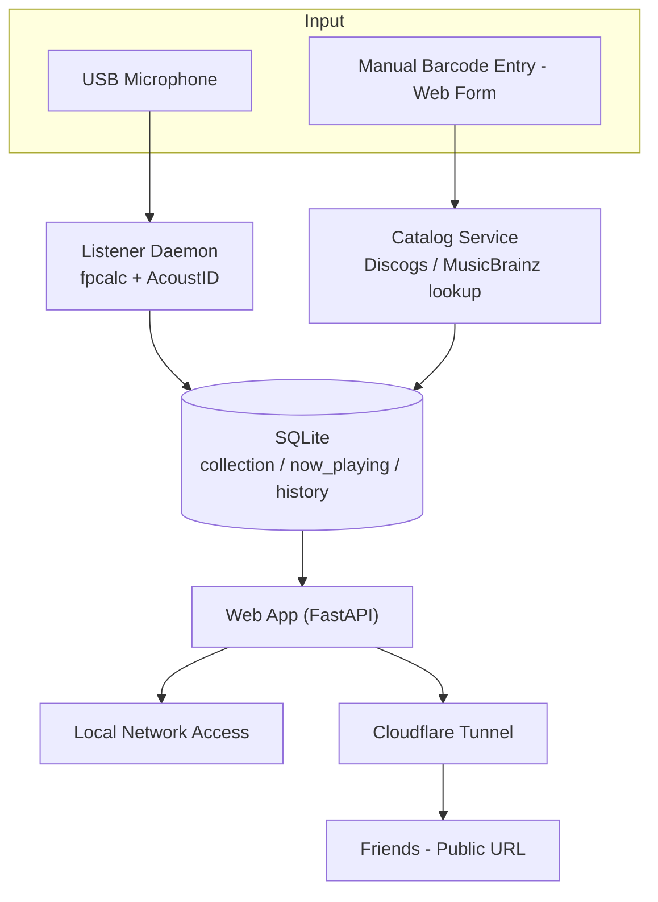

# Physical Media Tracker

A Raspberry Pi box that listens to your CD player, identifies what's playing via audio fingerprinting, and shows your collection — plus what's currently spinning — to friends on a live web page.

## How it works

- **Now playing:** a USB mic samples audio near the CD player, fingerprints it with Chromaprint (`fpcalc`), and identifies the track via the AcoustID API.
- **Collection:** albums are cataloged by entering their barcode manually through a web form, which is looked up against the Discogs and MusicBrainz APIs for metadata and cover art.
- **Sharing:** the web app runs entirely on the Pi and is exposed to the internet via a free Cloudflare Tunnel — no separate server, no port forwarding.

## Architecture

Full design notes and tradeoffs: [`docs/ARCHITECTURE.md`](docs/ARCHITECTURE.md).

## Tech stack

- **Hardware:** Raspberry Pi 4, USB microphone, standard CD player (turntable planned later)
- **Backend:** Python, FastAPI, SQLite
- **Audio ID:** Chromaprint (`fpcalc`), AcoustID API
- **Catalog lookup:** Discogs API, MusicBrainz API
- **Sharing:** Cloudflare Tunnel

## Project status

Currently in the setup/planning phase — no code yet. Full task breakdown: [`task.md`](task.md).

| Phase | Description | Status |
|---|---|---|
| 0 | Project & process setup (repo, board, docs) | In progress |
| 1 | Catalog MVP (manual barcode entry) | Not started |
| 2 | Now-playing / audio ID MVP | Not started |
| 3 | Web UI polish | Not started |
| 4 | Public sharing (Cloudflare Tunnel) | Not started |
| 5 | Vinyl support | Not started |
| 6 | Documentation & portfolio packaging | Not started |

## Getting started

Setup instructions will be added here once Phase 1 is implemented.

## Documentation

- [`docs/ARCHITECTURE.md`](docs/ARCHITECTURE.md) — system design and tradeoffs
- [`docs/adr/`](docs/adr) — architecture decision records
- [`DEVLOG.md`](DEVLOG.md) — dated build log
- [`task.md`](task.md) — full task breakdown

## License

MIT
