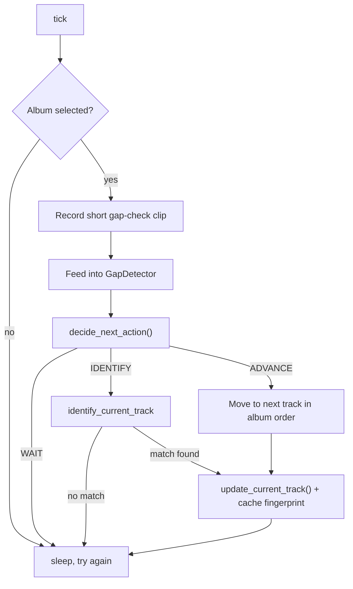
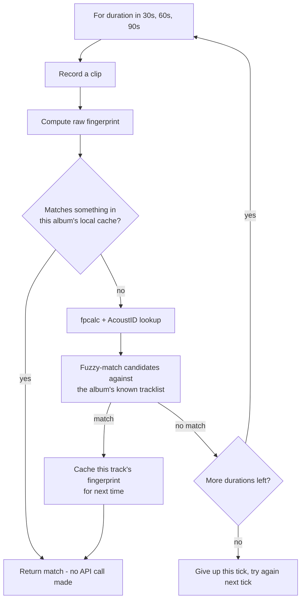

# Now-Playing Pipeline: How Track Identification Actually Works

This document walks through, end to end, how a spinning CD goes from "the
listener has no idea what's playing" to "the web page shows the correct
track." It's the *how*; for the *why* behind this specific design (and the
empirical data that led to it), see
[`docs/adr/ADR-002`](adr/ADR-002). For a narrative account of building and
testing it, see [`DEVLOG.md`](DEVLOG.md).

## The core idea in one paragraph

A naive approach — record a short clip, fingerprint it, ask AcoustID "what
is this out of all recorded music" — turned out to be too slow and
unreliable to catch track changes responsively (see ADR-002: clips under
~90 seconds frequently returned nothing from AcoustID, even from perfectly
clean audio). So instead, the user tells the system which album is about to
play, which shrinks the identification problem from "which of ~40 million
recordings is this" down to "which of ~15 known tracks is this." That
constraint is what makes every other trick in this pipeline possible.

## Prerequisite: the album is already cataloged

Before any of this runs, the album has to already be in `collection` (Phase
1 — scanned by barcode, matched against Discogs/MusicBrainz). This pipeline
doesn't catalog anything; it only identifies which already-cataloged track
is currently playing.

## Step 1 — Selecting what's about to play

The user picks an album via `GET /listen`, which posts to `POST /listen`
([`app/main.py`](../app/main.py)):

1. If this album's tracklist hasn't been fetched before, `catalog.fetch_tracklist()`
   pulls it from whichever source originally matched the album — Discogs'
   release-detail endpoint if we have a `discogs_id`, MusicBrainz's release
   endpoint (with `inc=recordings`) if we have a `musicbrainz_id`.
2. `catalog.save_tracks()` stores the ordered tracklist (title, position,
   duration in seconds) in the `tracks` table.
3. `catalog.set_active_album()` sets `now_playing.collection_id` to this
   album, with `track_title = NULL` — meaning "this album is selected, but
   no specific track has been confirmed yet."

## Step 2 — The listener loop

[`listener.py`](../listener.py) runs continuously (as `listener.service` on
the Pi). Every few seconds it calls `tick()`, which does one iteration of:

**Why a gap detector at all:** it's cheap (just RMS energy on a short
clip, no fingerprinting or network calls) and it's what makes skip
detection *fast*. It tells the listener the instant a track boundary
happens, instead of waiting on a fixed polling interval to notice.

**The three possible actions** (`app/timer.py::decide_next_action`):

| Action | When | What happens |
|---|---|---|
| `IDENTIFY` | No track is known yet, or a gap fired *before* the current track's known duration would predict — i.e., a skip | Run the full identification flow (Step 3) |
| `ADVANCE` | The current track's known duration has elapsed with no early gap | Move to the next track in the stored album order — no recording, no API call |
| `WAIT` | Nothing has happened yet | Do nothing this tick |

`ADVANCE` is the cheap path: once a track is confirmed, the system trusts
the album's own track order and durations (from the `tracks` table) rather
than re-identifying every single track. It only falls back to `IDENTIFY`
when the gap detector notices something that doesn't match that
expectation (a skip).

## Step 3 — Identifying a track (`app/identify.py::identify_current_track`)

This is the expensive path, run only when needed:

Two matching strategies, tried in this order, at each escalating clip
length:

1. **Local fingerprint cache first** (`app/local_match.py`). If this exact
   track (on this album) has ever been identified before, its own-mic
   fingerprint was cached (`tracks.cached_fingerprint`). A fresh raw
   fingerprint (from `fpcalc -raw`, no network involved) is compared
   against every cached fingerprint for this album using the same
   alignment-based similarity Chromaprint itself uses internally
   (reimplemented in pure Python — see ADR-002 for why: the compressed
   fingerprint comparison needs a shared library we don't have installed,
   but the raw/uncompressed form doesn't). A hit here costs nothing but
   local computation — no AcoustID call at all.
2. **Album-constrained fuzzy AcoustID matching** (`app/track_matcher.py`),
   if nothing was cached. The clip is fingerprinted (compressed form this
   time) and sent to AcoustID. Critically, the result doesn't need to be a
   single dominant high-confidence match against the whole AcoustID
   database — a much lower-confidence result is accepted *if its title
   fuzzy-matches one of the known tracks on this album*. That's the payoff
   of Step 1: the candidate set is small and known, so a moderate score
   is trustworthy in a way it wouldn't be otherwise.

If a match is found, its fingerprint gets cached immediately
(`catalog.save_track_fingerprint`) — the next time this same disc plays,
it'll likely resolve from the cache instead, skipping AcoustID (and its
duration requirements) entirely.

If no duration produces a match, `identify_current_track` gives up for
this tick. That's fine — the next tick tries again, and the gap detector
means it won't be stuck re-identifying for long once real audio (not a
gap) resumes.

## Step 4 — Recording what's confirmed

Whether a track was just identified (Step 3) or advanced to by the timer
(Step 2's `ADVANCE`), the same function commits it
(`app/catalog.py::update_current_track`):

- `now_playing` is updated: `track_title`, `started_at = now`, `source`.
- A new row is appended to `history`.

`source` is `'fingerprint'` for anything the pipeline decided (both a real
identification *and* a timer-based advance — both are automated, as
opposed to `'manual'`, which is only set at initial album selection before
any track is confirmed).

## Step 5 — Showing it on the web

`GET /now-playing` ([`app/main.py`](../app/main.py)) reads `now_playing`
joined against `collection`, plus the album's `tracks`, and renders the
current album, current track (if any), and full tracklist. This is what a
visitor to the site sees — nothing in this page does any identification
itself, it just displays whatever the listener loop has already decided.

## Data model reference

| Table | Role in this pipeline |
|---|---|
| `collection` | The catalog of owned albums (Phase 1). Provides `discogs_id`/`musicbrainz_id` used to fetch tracklists. |
| `tracks` | Per-album tracklist: title, order, duration, and (once identified at least once) the cached fingerprint. |
| `now_playing` | Single row: which album is selected, which track is currently believed to be playing, and how we know (`source`). |
| `history` | Append-only log of every track the pipeline has ever set as playing. |

## Module map

| File | Responsibility |
|---|---|
| [`app/gap_detector.py`](../app/gap_detector.py) | Detects sustained silence (a track boundary) from a stream of audio chunks. Pure signal processing, no fingerprinting. |
| [`app/fingerprint.py`](../app/fingerprint.py) | Records audio clips; wraps `fpcalc`/AcoustID for both the compressed (AcoustID lookup) and raw (local comparison) fingerprint forms. |
| [`app/local_match.py`](../app/local_match.py) | Pure-Python similarity comparison between two raw fingerprints. |
| [`app/track_matcher.py`](../app/track_matcher.py) | Album-constrained fuzzy title matching against AcoustID results. |
| [`app/identify.py`](../app/identify.py) | Ties cache lookup + fuzzy matching + progressive clip length together into one "identify the current track" call. |
| [`app/timer.py`](../app/timer.py) | Pure decision logic: identify vs. advance vs. wait. |
| [`app/catalog.py`](../app/catalog.py) | All database reads/writes: tracklists, cache storage, `now_playing`/`history` updates. |
| [`listener.py`](../listener.py) | The actual long-running loop tying everything above together. |

## What real-world testing found

Verified against a real CD player through a Focusrite line-in (not just
mic recordings or clean files — see `DEVLOG.md` for the full account):

- The pipeline works end to end against real hardware: a real recording
  of Electric Ladyland's first track matched correctly through the entire
  flow, including the fuzzy matcher and the cache.
- Not every disc is guaranteed to match. A clean, correct, ear-verified
  recording of "Come Together" from an Abbey Road CD returned zero
  AcoustID results across every clip length tested (15–90s) — most likely
  because that CD's specific mix/mastering isn't what's fingerprinted in
  AcoustID's database, not because of anything wrong with the pipeline.
  This is a real, known limitation: some specific discs may just never
  match via AcoustID, regardless of tuning. The local fingerprint cache
  exists partly *because* of this — once a track is identified by any
  means (even eventually a manual override), repeat plays of that same
  disc stop depending on AcoustID being able to find it again.
