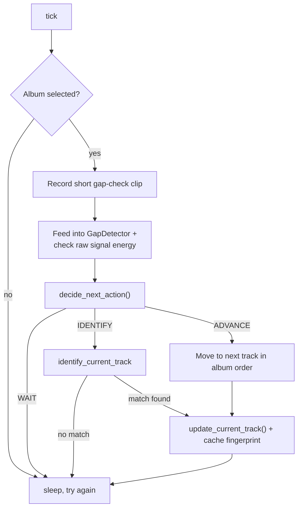
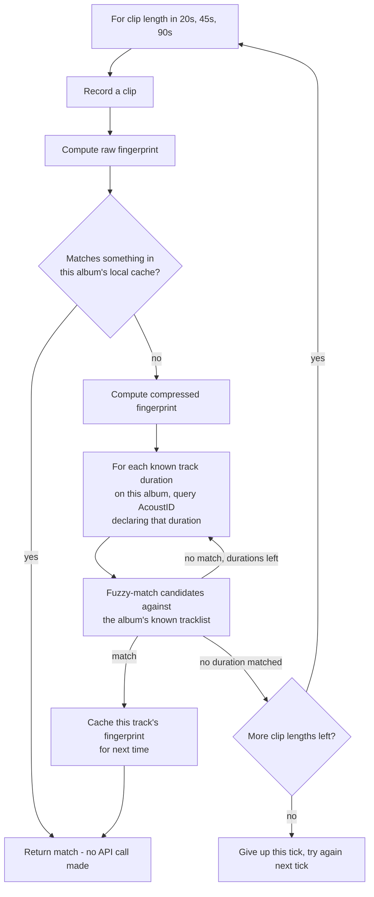

# Now-Playing Pipeline: How Track Identification Actually Works

This document walks through, end to end, how a spinning CD goes from "the
listener has no idea what's playing" to "the web page shows the correct
track." It's the *how*; for the *why* behind this specific design (and the
empirical data that led to it), see [`docs/adr/ADR-002`](adr/ADR-002)
(album-context-aware identification) and [`docs/adr/ADR-003`](adr/ADR-003)
(querying AcoustID with the right duration). For a narrative account of
building and testing it, see [`DEVLOG.md`](DEVLOG.md).

## The core idea in one paragraph

A naive approach — record a short clip, fingerprint it, ask AcoustID "what
is this out of all recorded music" — turned out to be too slow and
unreliable to catch track changes responsively (see ADR-002: clips under
~90 seconds frequently returned nothing from AcoustID, even from perfectly
clean audio). So instead, the user tells the system which album is about to
play, which shrinks the identification problem from "which of ~40 million
recordings is this" down to "which of ~15 known tracks is this." That
constraint is what makes every other trick in this pipeline possible.

## Prerequisite: the album is already cataloged

Before any of this runs, the album has to already be in `collection` (Phase
1 — scanned by barcode, matched against Discogs/MusicBrainz). This pipeline
doesn't catalog anything; it only identifies which already-cataloged track
is currently playing.

## Step 1 — Selecting what's about to play

The user picks an album via `GET /listen`, which posts to `POST /listen`
([`app/main.py`](../app/main.py)):

1. If this album's tracklist hasn't been fetched before, `catalog.fetch_tracklist()`
   pulls it from whichever source originally matched the album — Discogs'
   release-detail endpoint if we have a `discogs_id`, MusicBrainz's release
   endpoint (with `inc=recordings`) if we have a `musicbrainz_id`.
2. `catalog.save_tracks()` stores the ordered tracklist (title, position,
   duration in seconds) in the `tracks` table.
3. `catalog.set_active_album()` sets `now_playing.collection_id` to this
   album, with `track_title = NULL` — meaning "this album is selected, but
   no specific track has been confirmed yet."

## Step 2 — The listener loop

[`listener.py`](../listener.py) runs continuously (as `listener.service` on
the Pi). It calls `tick()` in a tight loop (~2.5s per iteration: a 2s
gap-check recording plus a short sleep), which does one iteration of:

```mermaid
flowchart TD
    A[tick] --> B{Album selected?}
    B -- no --> Z[sleep, try again]
    B -- yes --> C[Record short gap-check clip]
    C --> D[Feed into GapDetector +\ncheck raw signal energy]
    D --> E["decide_next_action()"]
    E -- IDENTIFY --> F[identify_current_track]
    E -- ADVANCE --> G[Move to next track in album order]
    E -- WAIT --> Z
    F -- match found --> H["update_current_track() + cache fingerprint"]
    F -- no match --> Z
    G --> H
    H --> Z
```

**Why a gap detector at all:** it's cheap (just RMS energy on a short
clip, no fingerprinting or network calls) and it's what makes skip
detection *fast*. It tells the listener the instant a track boundary
happens, instead of waiting on a fixed polling interval to notice.

**The polling interval matters more than it looks like it should.** Each
tick only samples a short clip, not a continuous stream - between samples
there's a real dead zone where nothing is being recorded at all. A CD's
inter-track silence is often only 1-3 seconds long, and with the original
5-second sleep between ticks, that brief gap had a real chance of landing
entirely in the dead zone and never being observed - confirmed happening
during real testing (a manual skip went undetected for several minutes;
see `DEVLOG.md`, 2026-08-01). `POLL_INTERVAL_SECONDS` is deliberately kept
near-zero now specifically to minimize that blind spot without the added
complexity of a background monitoring thread.

That same cheap energy check also solves a different problem: there's no
signal connecting the physical CD player to this software at all, so the
listener starts polling the instant an album is selected — which could be
well before you've actually pressed play. Rather than burn a full 20-90s
identify attempt recording silence, `tick()` checks whether the gap-check
clip has any real signal in it first (`has_signal` in
`decide_next_action`), and just waits if it doesn't.

**The three possible actions** (`app/timer.py::decide_next_action`):

| Action | When | What happens |
|---|---|---|
| `IDENTIFY` | No track is known yet *and* the input actually has signal, or a gap fired at all | Run the full identification flow (Step 3) |
| `ADVANCE` | The current track's known duration has elapsed with no gap at all | Move to the next track in the stored album order — no recording, no API call |
| `WAIT` | Nothing has happened yet, or no track is known and the input is silent (playback probably hasn't started) | Do nothing this tick |

`ADVANCE` is the cheap path — used when a track's duration elapses with no
gap ever detected at all (e.g. a seamless mix with no silence between
tracks). Any actual detected gap always triggers a full `IDENTIFY`
instead, regardless of its timing. This used to try to distinguish an
"early" gap (a skip) from an "on-time" one (assumed to be a normal
transition, safe to just advance without a fresh AcoustID call) — but
that created a real gap in coverage: a skip whose gap happened to land
right around when the current track was also about to naturally end got
misclassified as a normal transition, showing the wrong track. Since
re-identification is position-independent (it searches the whole album,
not "the next track"), it handles forward skips, backward skips, and
random back-and-forth sequences identically — it doesn't matter *why* a
gap fired, only that one did. Confirmed necessary from real testing (see
`DEVLOG.md`, 2026-08-01), and affordable now that identification is fast
(usually resolves on the first ~20s clip — see ADR-003).

## Step 3 — Identifying a track (`app/identify.py::identify_current_track`)

This is the expensive path, run only when needed:

```mermaid
flowchart TD
    A[For clip length in 20s, 45s, 90s] --> B[Record a clip]
    B --> C[Compute raw fingerprint]
    C --> D{Matches something in\nthis album's local cache?}
    D -- yes --> E[Return match - no API call made]
    D -- no --> F[Compute compressed fingerprint]
    F --> G[For each known track duration\non this album, query AcoustID\ndeclaring that duration]
    G --> H[Fuzzy-match candidates against\nthe album's known tracklist]
    H -- match --> I[Cache this track's fingerprint\nfor next time]
    H -- no match, durations left --> G
    I --> E
    H -- no duration matched --> J{More clip lengths left?}
    J -- yes --> A
    J -- no --> K[Give up this tick, try again next tick]
```

Two matching strategies, tried in this order, at each escalating clip
length:

1. **Local fingerprint cache first** (`app/local_match.py`). If this exact
   track (on this album) has ever been identified before, its own-mic
   fingerprint was cached (`tracks.cached_fingerprint`). A fresh raw
   fingerprint (from `fpcalc -raw`, no network involved) is compared
   against every cached fingerprint for this album using the same
   alignment-based similarity Chromaprint itself uses internally
   (reimplemented in pure Python — see ADR-002 for why: the compressed
   fingerprint comparison needs a shared library we don't have installed,
   but the raw/uncompressed form doesn't). A hit here costs nothing but
   local computation — no AcoustID call at all.
2. **Album-constrained fuzzy AcoustID matching** (`app/track_matcher.py`),
   if nothing was cached. The clip is fingerprinted once (compressed form),
   then looked up **once per each of the album's known track durations**
   (`app/fingerprint.py::lookup_with_duration`) — not the clip's own
   recorded length. This is the critical, non-obvious part: AcoustID's
   matching is sensitive to how close the *declared* duration is to the
   true reference recording's length, almost independent of how much
   actual audio was fingerprinted. A clip declaring its own honest 20-second
   length reliably gets rejected; the same clip declaring the track's real
   ~200-second length matches at high confidence. See
   [`docs/adr/ADR-003`](adr/ADR-003) for the full investigation. Since we
   already have every candidate track's duration stored from cataloging
   (Step 1), we just try each one. On top of that, the result doesn't need
   to be a single dominant match against the whole AcoustID database — a
   lower-confidence result is accepted *if its title fuzzy-matches one of
   the known tracks on this album* (the ADR-002 payoff: a small, known
   candidate set makes a moderate score trustworthy).

If a match is found, its fingerprint gets cached immediately
(`catalog.save_track_fingerprint`) — the next time this same disc plays,
it'll likely resolve from the cache instead, skipping AcoustID entirely.

If no duration guess produces a match at the current clip length,
`identify_current_track` records a longer clip and tries again — this is
now mostly a safety net (e.g., a wrong/incomplete stored tracklist) rather
than the primary lever it was originally designed to be.

## Step 4 — Recording what's confirmed

Whether a track was just identified (Step 3) or advanced to by the timer
(Step 2's `ADVANCE`), the same function commits it
(`app/catalog.py::update_current_track`):

- `now_playing` is updated: `track_title`, `started_at = now`, `source`.
- A new row is appended to `history`.

`source` is `'fingerprint'` for anything the pipeline decided (both a real
identification *and* a timer-based advance — both are automated, as
opposed to `'manual'`, which is only set at initial album selection before
any track is confirmed).

## Step 5 — Showing it on the web

`GET /now-playing` ([`app/main.py`](../app/main.py)) reads `now_playing`
joined against `collection`, plus the album's `tracks`, and renders the
current album, current track (if any), and full tracklist. This is what a
visitor to the site sees — nothing in this page does any identification
itself, it just displays whatever the listener loop has already decided.

## Data model reference

| Table | Role in this pipeline |
|---|---|
| `collection` | The catalog of owned albums (Phase 1). Provides `discogs_id`/`musicbrainz_id` used to fetch tracklists. |
| `tracks` | Per-album tracklist: title, order, duration, and (once identified at least once) the cached fingerprint. |
| `now_playing` | Single row: which album is selected, which track is currently believed to be playing, and how we know (`source`). |
| `history` | Append-only log of every track the pipeline has ever set as playing. |

## Module map

| File | Responsibility |
|---|---|
| [`app/gap_detector.py`](../app/gap_detector.py) | Detects sustained silence (a track boundary) from a stream of audio chunks. Pure signal processing, no fingerprinting. |
| [`app/fingerprint.py`](../app/fingerprint.py) | Records audio clips; wraps `fpcalc`/AcoustID for both the compressed (AcoustID lookup) and raw (local comparison) fingerprint forms. |
| [`app/local_match.py`](../app/local_match.py) | Pure-Python similarity comparison between two raw fingerprints. |
| [`app/track_matcher.py`](../app/track_matcher.py) | Album-constrained fuzzy title matching against AcoustID results. |
| [`app/identify.py`](../app/identify.py) | Ties cache lookup + fuzzy matching + progressive clip length together into one "identify the current track" call. |
| [`app/timer.py`](../app/timer.py) | Pure decision logic: identify vs. advance vs. wait. |
| [`app/catalog.py`](../app/catalog.py) | All database reads/writes: tracklists, cache storage, `now_playing`/`history` updates. |
| [`listener.py`](../listener.py) | The actual long-running loop tying everything above together. |

## What real-world testing found

Verified against a real CD player through a Focusrite line-in, and later
against clean digital rips of the tracks that failed (see `DEVLOG.md` for
the full account):

- The pipeline works end to end against real hardware: a real recording
  of Electric Ladyland's first track matched correctly through the entire
  flow, including the fuzzy matcher and the cache.
- A round of testing on 2026-07-20/21 found a ~20% hit rate (1 match out of
  5 albums) via line-in, with every miss looking like a genuine AcoustID
  coverage gap — clean recordings, human-confirmed correct tracks, zero
  results at every clip length tried. That conclusion turned out to be
  wrong: testing clean digital rips of the exact failing tracks proved
  AcoustID had them well-fingerprinted all along (0.96-0.99 confidence).
  The real cause was the duration bug described in Step 3 and
  [`docs/adr/ADR-003`](adr/ADR-003) — every one of those "misses" was our
  own pipeline declaring the wrong duration to AcoustID, not a database gap.
  Fixed, and verified against the same three previously-failing tracks
  through the real pipeline, matching correctly on clips as short as 20
  seconds.
- Re-validating the fix against real CD player line-in audio (not just
  digital files) is the next real test.
